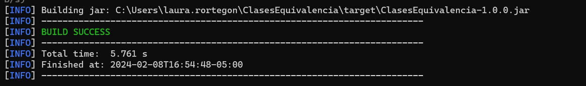
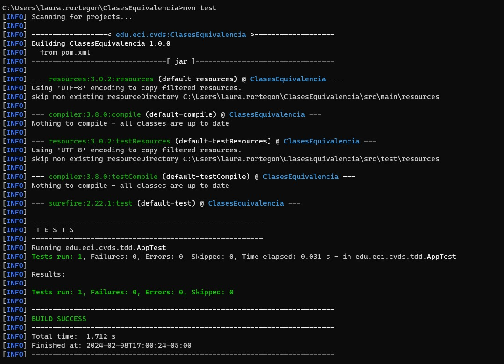
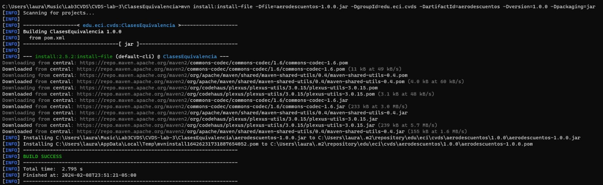

# Laboratorio 2 - Patterns


* Universidad: Escuela Colombiana de Ingeniería
* Asignatura:  CVDS
* Autores: Laura Valentina Rodríguez Ortegón-Juan Pablo Fernandez Gonzalez

### Maven

Apache Maven es una herramienta de gestión de proyectos de código abierto y gratuita, especialmente popular para proyectos .Java
Se utiliza para automatizar tareas comunes del ciclo de vida del desarrollo de software, como:

1. Gestión de dependencias: Maven facilita la búsqueda, descarga e integración de bibliotecas y frameworks externos en tu proyecto.
2. Compilación: Maven automatiza el proceso de compilación de tu código fuente, incluyendo la gestión de diferentes tipos de archivos (Java, Scala, etc.) y la ejecución de pruebas.
3. Empaquetado: Maven te permite crear diferentes tipos de paquetes para tu proyecto, como JARs, WARs y EARs.
4. Implementación: Maven facilita la implementación de tu proyecto en un servidor de aplicaciones.
5. Documentación: Maven puede generar automáticamente la documentación de tu proyecto a partir de los comentarios del código fuente.

### Crear un proyecto con Maven
Necesitaremos de los siguientes parametros para la creación de nuestro proyecto
* Grupo: edu.eci.cvds
* Id del Artefacto: Patterns
* Paquete: edu.eci.cvds.patterns
* archetypeArtifactId: maven-archetype-quickstart


### Compilar y Ejecutar
* Para compilar ejecute el comando:
```
$ mvn -U package
```



* Para ejecutar el proyecto
```
mvn exec:java -Dexec.mainClass="edu.eci.cvds.patterns.shapes.ShapeMain" -Dexec.args="Triangle"
```



